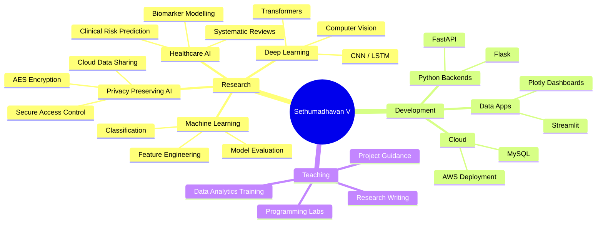
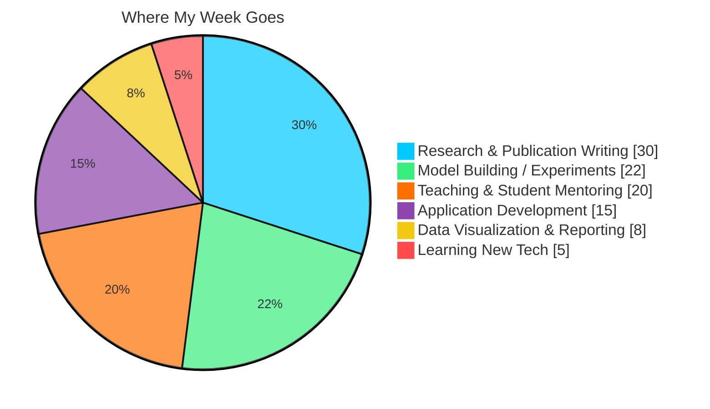
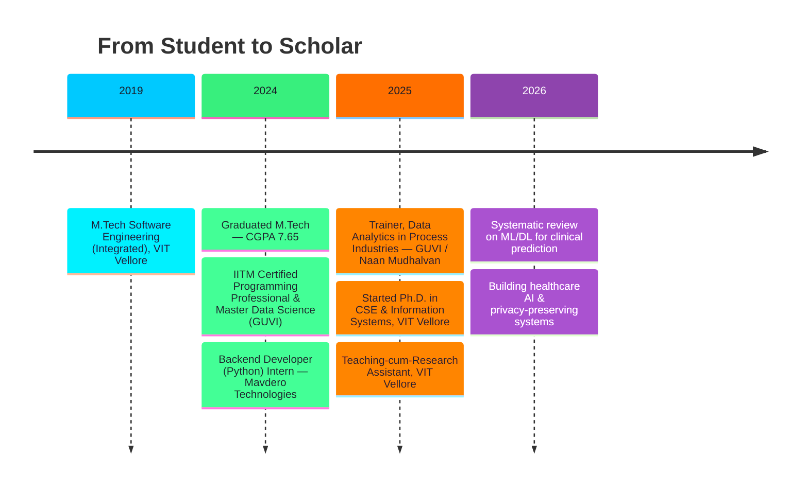

<!-- ═══════════════════════════════════════════════════════════════════════
     GitHub Profile README — Sethumadhavan V
     Theme: Cyan (#00C9FF) → Mint (#92FE9D) gradient  |  Accent: #FF6F00
     ═══════════════════════════════════════════════════════════════════════ -->

<!-- ─────────────────────────  ANIMATED HEADER  ───────────────────────── -->

<p align="center">
  
</p>

<p align="center">
  
</p>

<p align="center">
  <a href="https://www.linkedin.com/in/sethumadhavan-v/">
    
  </a>
  <a href="mailto:sethumadhavanvelu2002@gmail.com">
    
  </a>
  <a href="https://github.com/SETHU0010">
    
  </a>
  <a href="https://github.com/SETHU0010?tab=followers">
    
  </a>
  
</p>

<p align="center">
  
</p>


<!-- ─────────────────────────  QUICK SNAPSHOT  ───────────────────────── -->

##  Quick Snapshot

> [!NOTE]
> **Currently:** Ph.D. Scholar & Teaching-cum-Research Assistant at **VIT Vellore** — researching machine learning and deep learning for **healthcare decision support** and **privacy-preserving systems**.

<table>
  <tr>
    <td width="33%" align="center">
      <br />
      Applied AI · Healthcare ML<br />Privacy-Preserving Systems
    </td>
    <td width="33%" align="center">
      <br />
      Python · Streamlit · Flask<br />FastAPI · SQL · Power BI · AWS
    </td>
    <td width="33%" align="center">
      <br />
      Programming Labs · Analytics<br />Project & Research Mentoring
    </td>
  </tr>
</table>


<!-- ─────────────────────────  ABOUT ME  ───────────────────────── -->

##  About Me

```python
class Sethumadhavan:
    def __init__(self):
        self.role        = "Ph.D. Scholar | Teaching-cum-Research Assistant"
        self.institute   = "Vellore Institute of Technology, Vellore"
        self.program     = "CSE & Information Systems"
        self.research    = ["Healthcare AI", "Machine Learning",
                            "Deep Learning", "Privacy-Preserving AI"]
        self.stack       = ["Python", "SQL", "Power BI", "Streamlit",
                            "Flask", "FastAPI", "MySQL", "AWS"]
        self.languages   = {"Tamil": "Native", "English": "Professional"}

    def current_focus(self) -> str:
        return "Turning clinical data into decision-support systems 🩺📊"

    def say_hi(self):
        print("Thanks for dropping by — let's build something useful!")


me = Sethumadhavan()
me.say_hi()
```

I am **Sethumadhavan V**, working at the intersection of **artificial intelligence, data science, and applied research**. My interests span machine learning, deep learning, data visualization, software engineering, business analytics, cloud engineering, real-time analytics, and automation in education.


<!-- ─────────────────────────  RESEARCH MINDMAP  ───────────────────────── -->

##  Research Landscape




<!-- ─────────────────────────  TECH STACK  ───────────────────────── -->

##  Tech Stack

<p align="center">
  
</p>

### 

<p>
  
  
  
  
  
</p>

### 

<p>
  
  
  
  
  
  
</p>

### 

<p>
  
  
  
  
  
  
  
  
</p>

### 

<p>
  
  
  
  
  
  
  
  
</p>


<!-- ─────────────────────────  SKILL LEVELS  ───────────────────────── -->

##  Skill Proficiency

| Skill | Proficiency | Level |
|:--|:--|:--:|
|  | `████████████████████░` | **95%** |
|  | `██████████████████░░░` | **88%** |
|  | `██████████████████░░░` | **87%** |
|  | `█████████████████░░░░` | **85%** |
|  | `████████████████░░░░░` | **82%** |
|  | `████████████████░░░░░` | **80%** |
|  | `███████████████░░░░░░` | **78%** |
|  | `█████████████░░░░░░░░` | **70%** |




<!-- ─────────────────────────  JOURNEY TIMELINE  ───────────────────────── -->

##  Academic & Professional Journey




<!-- ─────────────────────────  EDUCATION  ───────────────────────── -->

##  Education

<table>
  <tr>
    <td width="60%"><b>Ph.D. — Computer Science Engineering & Information Systems</b><br />
      <sub>Vellore Institute of Technology, Vellore</sub></td>
    <td align="center"></td>
  </tr>
  <tr>
    <td><b>M.Tech Software Engineering (Integrated)</b><br />
      <sub>Vellore Institute of Technology, Vellore — CGPA 7.65</sub></td>
    <td align="center"></td>
  </tr>
  <tr>
    <td><b>IITM Certified Programming Professional & Master Data Science</b><br />
      <sub>IIT Madras via GUVI Platform</sub></td>
    <td align="center"></td>
  </tr>
</table>


<!-- ─────────────────────────  EXPERIENCE  ───────────────────────── -->

##  Professional Experience

<details open>
<summary><b>🎓 Teaching-cum-Research Assistant — VIT Vellore</b> <code>Aug 2025 – Present</code></summary>

<br />

- Conduct laboratory sessions and guide students through programming and technical problem-solving.
- Assist with tutorials, evaluations, and continuous assessment for UG and PG courses.
- Support academic and research activities while pursuing doctoral research.
- Mentor students in Python programming, data analytics, and project development.

</details>

<details>
<summary><b>💻 Backend Developer (Python) — Mavdero Technologies</b> <code>Sep 2024 – Jul 2025</code></summary>

<br />

- Developed and deployed AI-based automation tools for enterprise workflows.
- Applied machine learning techniques to real-time datasets to improve decision-making.
- Supported Python backend workflows, API development, and data-driven applications.

</details>

<details>
<summary><b>📊 Trainer, Data Analytics — GUVI Geek Network / Naan Mudhalvan</b> <code>Feb 2025 – May 2025</code></summary>

<br />

- Delivered hands-on training in Python, SQL, and Power BI.
- Guided students in developing industry-oriented data analytics projects.
- Helped learners understand EDA, visualization, and applied analytics workflows.

```mermaid
%%{init: {'theme':'base', 'themeVariables': {
  'primaryColor':'#00C9FF','primaryTextColor':'#1a1b27','primaryBorderColor':'#38EF7D',
  'lineColor':'#38EF7D','secondaryColor':'#FF6F00','tertiaryColor':'#8E44AD',
  'fontSize':'15px'}}}%%
flowchart LR
    A[📥 Problem<br/>Definition] --> B[🗄️ Data Collection<br/>& Cleaning]
    B --> C[🔍 EDA &<br/>Feature Engineering]
    C --> D{Model Type?}
    D -->|Structured| E[🌲 ML Models<br/>RF · XGBoost · SVM]
    D -->|Sequential / Image| F[🧠 DL Models<br/>CNN · LSTM · ViT]
    E --> G[📈 Evaluation<br/>AUC · F1 · Recall]
    F --> G
    G --> H[🚀 Deployment<br/>Streamlit / Flask / AWS]
    H --> I[📊 Dashboard &<br/>Reporting]
    I --> J[📝 Publication /<br/>Documentation]

    style A fill:#00C9FF,stroke:#1a1b27,color:#1a1b27
    style D fill:#F2C811,stroke:#1a1b27,color:#1a1b27
    style E fill:#38EF7D,stroke:#1a1b27,color:#1a1b27
    style F fill:#8E44AD,stroke:#1a1b27,color:#ffffff
    style H fill:#FF6F00,stroke:#1a1b27,color:#ffffff
    style J fill:#FF4B4B,stroke:#1a1b27,color:#ffffff
```

</details>


<!-- ─────────────────────────  PROJECT PIPELINE  ───────────────────────── -->

##  How I Build Things




<!-- ─────────────────────────  FEATURED REPOS  ───────────────────────── -->

##  Featured Projects

<p align="center">
  <a href="https://github.com/SETHU0010/Automated-Resume-Parsing-and-Skill-Analysis-System">
    
  </a>
  <a href="https://github.com/SETHU0010/YouTube_Data_Harvesting_and_Warehousing_using_SQL_and_Streamlit">
    
  </a>
</p>

<p align="center">
  <a href="https://github.com/SETHU0010/Water_Safety_Classification_App">
    
  </a>
  <a href="https://github.com/SETHU0010/Loan-Risk-Assessment-Using-Machine-Learning-and-Streamlit">
    
  </a>
</p>

### All Selected Work

| Project | Focus | Tech | Link |
|:--|:--|:--|:--:|
| **Automated Resume Parsing & Skill Analysis** | NLP, resume ranking |    | [🔗](https://github.com/SETHU0010/Automated-Resume-Parsing-and-Skill-Analysis-System) |
| **Secure Health Record Sharing (AES)** | Encryption, access control |   | `Coming soon` |
| **YouTube Data Harvesting & Warehousing** | ETL, warehousing |   | [🔗](https://github.com/SETHU0010/YouTube_Data_Harvesting_and_Warehousing_using_SQL_and_Streamlit) |
| **Water Safety Classification App** | Classification ML |   | [🔗](https://github.com/SETHU0010/Water_Safety_Classification_App) |
| **Loan Risk Assessment** | Risk prediction |   | [🔗](https://github.com/SETHU0010/Loan-Risk-Assessment-Using-Machine-Learning-and-Streamlit) |
| **GenAI Use Case Generation System** | Generative AI, ideation |  | [🔗](https://github.com/SETHU0010/GenAI_Use_Case_Generation_System) |
| **PhonePe Pulse Visualization** | Interactive dashboards |  | `Coming soon` |
| **Uber Fare Prediction** | Regression, deployment |  | `Coming soon` |


<!-- ─────────────────────────  GITHUB STATS  ───────────────────────── -->

##  GitHub Analytics

<p align="center">
  
  
</p>

<p align="center">
  
  
</p>

<h3 align="center">🏆 Trophy Cabinet</h3>

<p align="center">
  
</p>

<h3 align="center">📈 Contribution Activity</h3>

<p align="center">
  
</p>


<!-- ─────────────────────────  CERTIFICATIONS  ───────────────────────── -->

##  Certifications

<p align="center">
  
  
  
  
</p>
<p align="center">
  
  
  
  
</p>


<!-- ─────────────────────────  PUBLICATIONS  ───────────────────────── -->

##  Publications

> [!TIP]
> **In progress** — a systematic review of machine learning and deep learning methods for clinical prediction, targeting a Q1/Q2 journal. Watch this space.

| Status | Work | Venue |
|:--:|:--|:--|
|  | Systematic review — ML/DL for clinical risk prediction | Q1/Q2 Journal |
|  | Privacy-preserving health data sharing | TBD |


<!-- ─────────────────────────  BEYOND CODE  ───────────────────────── -->

##  Beyond the Code

<p align="center">
  
  
  
  
  
  
</p>

<h3 align="center">Languages</h3>

<p align="center">
  
  
</p>

<p align="center">
  
</p>


<!-- ─────────────────────────  CONNECT  ───────────────────────── -->

##  Let's Connect

<p align="center">
  Open to collaboration in <b>research projects</b>, <b>analytics applications</b>,
  <b>AI-based systems</b>, <b>student mentoring</b>, and <b>educational initiatives</b>.
</p>

<p align="center">
  <a href="mailto:sethumadhavanvelu2002@gmail.com">
    
  </a>
  <a href="https://www.linkedin.com/in/sethumadhavan-v/">
    
  </a>
  <a href="https://github.com/SETHU0010">
    
  </a>
</p>

<p align="center">
  
</p>

<p align="center">
  <i>⭐ If any of my work helps you, a star means a lot!</i>
</p>
